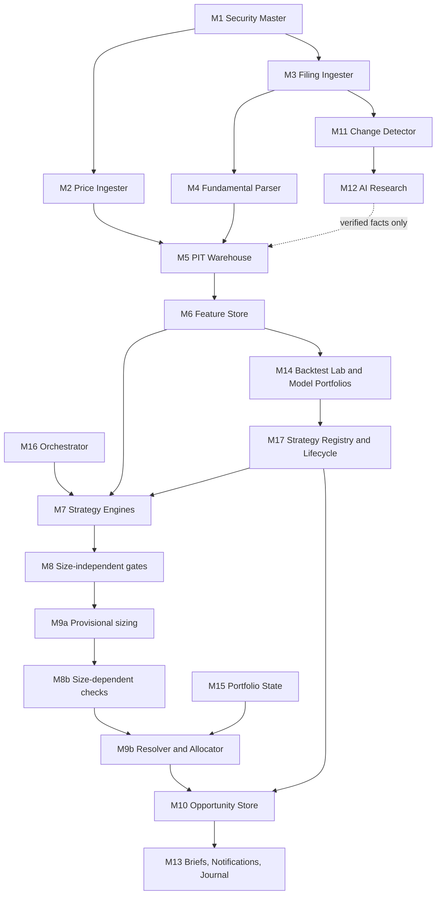

# Core Platform Architecture — Document 01 r7

*Release r5.4 · 24 September 2026 · current state only; revision history is in the Issue Log*

## 1. Purpose, boundary and invariants

The platform continuously evaluates Indian listed equities across every active strategy and surfaces an opportunity only when at least one production strategy qualifies it. It knows nothing about any strategy's economics: strategies are data (cards) that the platform loads, compiles and runs.

**Invariants — true regardless of strategy:**

1. Point-in-time truth: nothing is used before `usable_from = greatest(effective_from, system_available_at)` is at or before the cutoff **of its own data domain** (Document 02 §3).
2. Unknown is a value, never a zero, a false or a pass.
3. Deterministic numerical logic. AI reads documents and proposes extractions; it never scores, forecasts, sets thresholds or promotes strategies.
4. Absolute gates, never quotas. Silence is a valid output.
5. Every signal expires. Expiry never sells a holding; only exit rules sell.
6. Immutable raw inputs and immutable executed trades.
7. No credential in the system can place an order.
8. Scope grows by substitution, not addition.

## 2. Document set and authority

| Artefact | Owns | Precedence |
| --- | --- | --- |
| Overview v5 | Product scope and principles | Lowest — explanatory |
| Document 01 (this) | Modules, flows, state machines, boundaries | Architecture |
| Document 02 | Tables, fields, sources, timing, feature definitions | Governs every definition |
| `registry.yaml` | Feature, function, enum, class, trigger and policy vocabularies | Machine form of Document 02 |
| `strategies/*.yaml` | Each strategy's hypothesis, thresholds and rules | Only executable source of a strategy |
| Document 03 | Explanation of the strategies; card sections **generated** from the YAML | Never authoritative over the YAML; parity-checked |
| `schemas/*.json` | Closed shapes for cards, run manifests, portfolio policy, lifecycle transitions | Machine form |
| Document 04 r3 | Validation, simulation, costs, tax, golden cases | Governs how backtests are run |
| Document 05 *(before M12)* | AI evidence schema, threat model, model governance | Gate before any AI component |
| Document 06 *(before dashboard)* | Presentation semantics | — |
| Document 07 *(phased — §17)* | DDL, migrations, CI, deployment, operations, non-execution enforcement | Each control is due at the phase §17 names, not all at once |

**The controlling package is the set of files bound by `MANIFEST.json`.** An editable document is a draft until it is exported into the package and hashed.

## 3. Modules and flow



| Module | Responsibility |
| --- | --- |
| M1 Security Master | ISIN identity, aliases, state tables, corporate actions, share counts |
| M2 Price Ingester | Versioned daily price observations; the three price series |
| M3 Filing Ingester | Announcements and filings with exchange timestamps; archival by hash |
| M4 Fundamental Parser | Canonical financial facts with reporting durations and versions |
| M5 PIT Warehouse | The only answer to "what was known at `as_of_ts`" |
| M6 Feature Store | Every feature in the registry, computed from M5 only |
| M7 Strategy Engines | One engine instance per active card; evaluates gates, ranking and exits |
| M8 / M8b | Size-independent gates; size-dependent checks after provisional sizing |
| M9a | Provisional size per strategy claim, from the card's sizing method |
| M9b Resolver and Allocator | Merges claims per security; applies the portfolio policy; final sizes |
| M10 Opportunity Store | Opportunities, strategy claims, lifecycle states; **enforces publication rights** |
| M11 Change Detector | Deterministic document diffing before any AI |
| M12 AI Research | Structured extraction and thesis monitoring; no credentials; Document 05 gate |
| M13 Briefs, Notifications, Journal | Opportunity briefs, urgency routing, decisions |
| M14 Backtest Lab | Simulation, walk-forward, trials, model portfolios per strategy |
| M15 Portfolio State | Read-only holdings, cash and executed trades; reconciliation (Doc 02 §15) |
| M16 Orchestrator | Schedules and event triggers; decides which engines run and when |
| M17 Strategy Registry and Lifecycle | Loads compiled cards; owns status transitions and evidence |

## 4. Strategies, not buckets

- **A strategy is an independent method of detecting an opportunity**, defined by one card. It is not a category a stock belongs to, and not a capital bucket.
- **Strategy classes** (`fundamental_long_term`, `momentum`, `swing`, `event_catalyst`, `intraday`, and future ones) are registered with their allowed data resolutions, triggers and validation class. A card declares its class; the platform uses that only to select data, triggers and the validation protocol.
- **The set of strategies is open.** Adding one means adding a card that passes the linter and then the lifecycle. No platform code changes.
- **Notional capital** in a card exists only to run that strategy's model portfolio in M14, so its performance can be measured independently of what you act on. Your actual capital is governed by `portfolio_policy.yaml` and the allocator (§9). Per-strategy caps are optional user policy, `NONE` by default.
- **New strategies cannot appear autonomously.** The system may log candidate hypotheses for research. A strategy recommends only after the lifecycle in §10.

## 5. Orchestration

M16 runs every active engine on the triggers its card declares; you never choose a screen.

| Trigger | Fires | Typical use |
| --- | --- | --- |
| `daily_eod` | After the day's exchange files arrive (feed deadline 23:00 IST) | Risk loops; long-term re-evaluation |
| `weekly_eod` (weekday) | End of the named session each week | Momentum entry |
| `on_filing` | When M3 records a new or revised filing | Marks the security for the **next** `daily_eod` evaluation. A filing at 10:00 never evaluates against a session that has not closed |
| `intraday_interval` (minutes) | During the session | Intraday — reserved |
| `continuous_session` | On each new bar or quote | Intraday — reserved |

Each card declares **entry triggers** (when new signals may form) and one **risk trigger** (when exits, stops and invalidations on held claims are evaluated). Every run receives one `as_of_ts` and writes a run manifest (§13). Runs are idempotent: re-running with the same manifest produces the same outputs.

## 6. Universes

| Universe | Contains |
| --- | --- |
| Research | Every security with data, delisted included |
| Market-eligible | Point-in-time top-N by market cap, N and the buffers fixed by `policies/market_universe.yaml` (v1: N = 500), continuous-settlement series, not suspended. Nothing strategy-specific |
| Intraday-eligible *(reserved)* | Market-eligible, plus the intraday liquidity and data-coverage conditions of Document 02 §16 |
| Strategy-qualified | Per strategy: passes its own data requirements and gates |
| Personally actionable | Strategy-qualified, then the restricted list and portfolio policy applied |

Strategies are **measured** at the strategy-qualified layer; M14 never applies your restricted list. You **see** the personally actionable layer. A claim that is strategy-valid but blocked by your policy is kept and shown as *valid but not currently actionable*.

## 7. Evaluation semantics

- **Gates are tri-state:** pass, fail or unknown. Each declares whether unknown blocks candidacy.
- **Input resolution order within a gate:** `fail` behaviour first, then `exclude`, then `out_of_domain` outcomes, then `penalise` waivers. A `drop` input feeding a gate is unknown for that gate.
- **Selection methods:** `gate_only` (qualifies on gates alone) or `rank_and_gate` (scores the full strategy universe before gating, then ranks the survivors). Ranking is never required, and a rank never forces a recommendation.
- **Exits fire only when their expression is TRUE on known inputs.** Unknown raises a review trigger instead.
- **`persist(cond, n, unit)`** is TRUE if and only if `cond` is TRUE on the last *n* evaluable units; it is UNKNOWN if any of them is unknown, FALSE otherwise. Non-trading days are not units.
- **Stops are test-then-update:** the stop in force for session *t* is fixed at the close of *t−1*. Exits are tested first; the stop is then updated for the next session. The fill session is itself session *t*: a position exists at that close, so the stop is tested there too.
- **Unknown handling is defined, and material inputs may not be waived.** Every feature is **material** unless the registry lists it as secondary. A material input may never be `penalise`, and may never feed a gate that waives on unknown — otherwise a strategy silently becomes a different strategy wherever data is missing. `penalise` applies only to secondary inputs and has one exact effect: **each penalised input that is not known lowers `data_confidence` by one band** (`high → medium → low → insufficient`). Below `medium` a claim is recorded but never shown as a recommendation. Confidence never changes a score or a rank.

## 8. Strategy cards and the compiler

A card must satisfy `schemas/card.schema.json`, which is **closed**: any field not defined there is an error. `speclint.py` then compiles it against the registry:

1. **Schema stage** — shapes, types, ranges, positivity, semantic-version form, minimum hypothesis length, structured retirement and calibration. Malformed input produces errors, never a crash.
2. **Semantic stage** — the registry pin (version *and* SHA-256 must match the registry in use), class, data resolution and triggers, vocabularies, the expression grammar with types and arity, namespaced enum literals, reference integrity, runtime-state assignment (§11), corporate-action completeness, selection method, AI-input declarations, and status-dependent completeness: above `experimental`, no `OPEN`, `CALIBRATE` or placeholder function may remain.

`test_speclint.py` contains a regression case for every defect found in every review round, each asserting its specific violation, plus duplicate-key rejection, duplicate strategy codes across cards, and both real cards passing. It runs directly or under pytest.

**Limit:** a PASS proves a card is well-formed, not that it is right. Semantic correctness is established by Document 04's golden cases. **Freeze criterion for any card:** linter PASS, suite PASS, render parity PASS, golden cases PASS.

## 9. Opportunities, claims, sizing and allocation

**Opportunity (parent)** — one per security while any claim is live: `opportunity_id` · `isin` · `state` · `first_surfaced_at` · `final_qty` · `capital_reserved` · `actionability` (`actionable` / `valid_but_not_currently_actionable` + reason).

**Strategy claim (child)** — one per strategy per cycle: `claim_id` · `opportunity_id` · `strategy_code` · `card_sha256` · `cycle_no` · `direction` · `horizon` · `rank` · `rationale` · `gate_values` · `entry_ref` · `entry_high` · `tranche_limit` · `invalidation` · `expires_at` · `target_earmark_qty` · `current_earmark_qty` · `claim_state`. The key is `(opportunity_id, strategy_code, cycle_no)`, so a strategy can exit and re-qualify without overwriting its earlier cycle.

**States:** `signal` → `partially_entered` → `fully_entered` → `closing` → `closed`, plus terminal `expired` and `voided` for signals that never filled. Signal TTL applies only before the first fill. Void events are registered state transitions (registry `void_events`), not names.

**Conflicting claims are shown, not reconciled.** One strategy may be accumulating a security while another's exit fires on its own claim. Convergence is displayed and never scored or used to size up.

**Tranches.** Quantities convert at the prior session's close (known before the open), and the limit acts only as a price cap. Tranche 1 re-evaluates every gate on every attempt and voids the signal if any fails. Later tranches re-evaluate their declared gates; a failed recheck skips that session's attempt within the retry window. If the window is exhausted, remaining tranches are cancelled and reserved capital released — the holding is never sold. The final tranche takes the remainder, so integer flooring never strands shares.

**Allocator (M9b): one security, one decision.** Strategy claims size independently against their own notional capital — that is how each strategy is *measured*. The actual recommendation is decided once per security:

1. **Target = the largest live claim target**, never the sum. Two strategies agreeing must not mechanically double exposure; that is what "convergence is displayed, never sized up" means arithmetically.
2. **Caps applied in policy precedence order** (`portfolio_policy.yaml`): restricted list, per stock, per promoter group, per sector, per strategy (`NONE` by default), position count, cash floor, drawdown state.
3. **Scarce capacity is resolved deterministically**, without inventing a cross-strategy score: existing holdings first, then the earliest signal, then larger market cap, then ISIN. A claim that cannot reach `min_position_pct` within the remaining headroom is not actionable.
4. **A breach never deletes a claim.** It is marked `valid_but_not_currently_actionable`, with the binding cap named.
5. **When a claim closes, the target falls to what the remaining claims support** — the largest surviving target. The position is trimmed only if it exceeds that target by more than `trim_tolerance_pct`, so an exit by one strategy does not churn a holding another still supports.

**Executions.** `executed_trade` rows in M15 are immutable. `opportunity_execution` links a fill to one or more claims with `allocated_qty`; allocations must sum to the fill. Slippage is always computed from linked fills.

## 10. Strategy lifecycle and publication rights

A card's `status` is valid only if M17 holds a matching transition record (`schemas/strategy_lifecycle_transition.schema.json`): previous and new status, card SHA-256, decision, reason, and the evidence the transition requires.

| From → to | Evidence required |
| --- | --- |
| none → experimental | Linter PASS |
| experimental → shadow | Backtest run IDs, sealed holdout run, golden-case report, linter report; no OPEN, CALIBRATE or placeholders |
| shadow → production | Shadow run IDs over the declared period; linter report |
| production → suspended / retired | Reason; the retirement metric or data fault that triggered it |

| Status | May do |
| --- | --- |
| experimental | Backtest only |
| shadow | Generate shadow claims, recorded, never shown as recommendations |
| production | Publish claims to the opportunity feed |
| suspended / retired | No new claims; existing claims continue to exits |

**M10 enforces this server-side at publication.** A claim from a card whose recorded status is not `production` cannot become a visible recommendation, whatever the card file says.

## 11. Runtime state

Every runtime value in an expression has a declared owner in the registry:

| Owner | Meaning | Example |
| --- | --- | --- |
| `provided` | Supplied by the engine from a named source | `eval_date`, `holding_days` |
| `derived` | Computed from a card field, which must exist | `revised_target_value` ← `sizing.revised_formula` |
| `stateful` | Engine-maintained, with declared initialisation and update | `highest_close_since_entry`, `stop_in_force` |

The linter rejects any derived value whose card field is missing, and any stop state used without a stop.

**Stop state machine, per session *t*, for a held claim:**

1. Test exits against `stop_in_force` (fixed at *t−1*).
2. If not exited: if `close_raw(t) > highest_close_since_entry` (strictly), set `highest_close_since_entry = close_raw(t)` and `atr_pct_at_peak = atr_pct_20(t)`; ties change nothing.
3. `stop_prev = stop_in_force`; `stop_in_force = stop.update`.

On the fill date: `entry_basis` = the quantity-weighted fill price, `highest_close_since_entry` = the fill price, `atr_pct_at_peak = atr_pct_20`, and `stop_in_force = stop.initial`. That same session's close is then tested against it. Every price-state value is transformed by the corporate-action policy on ex-dates. The fill itself is never rewritten.

## 12. Briefs, notifications, monitoring and the journal

**Brief contents:** security; each claiming strategy with its status, horizon and direction; why now; triggering gate values; supporting evidence; **all material counter-evidence found, or an explicit "none found" once coverage is adequate**; data confidence, model status and evidence strength shown separately; portfolio fit and actionability; entry range, invalidation, expiry; lineage (run manifest ID).

**Notifications** are policy, separate from generation. Every qualifying claim is recorded, and urgency follows horizon: intraday and event claims notify immediately; days-to-weeks claims go to the daily brief; months-to-years claims go to the next brief. A "no qualifying opportunities" brief is itself published on schedule, carrying the funnel health summary.

**Monitoring** follows each live opportunity and reports what changed — a gate value moving, evidence arriving, expiry approaching — rather than regenerating the whole analysis.

**Journal:** three decision timestamps (generated, first viewed, decided) plus zero-to-many execution timestamps from linked fills. Accept, reject or defer, optionally with a reason. Model-versus-actual comparison is automatic.

## 13. Storage and reproducibility

- **Parquet is the source of truth**, written atomically, never edited. DuckDB runs in memory over explicit file lists generated from a snapshot. No persistent database file exists.
- **Run manifest** (`schemas/run_manifest.schema.json`): every evaluation, backtest, shadow run and replay records both domain cutoffs, the trading date, the data snapshot and its hash, the package digest, each card's hash and recorded status, the registry hash, source-policy, sector-map, calendar and CA-policy versions, the feature build (a version **and implementation hash per feature**), and the content hashes of the simulator, source policy, sector map, trading calendar, market-universe policy, cost schedule, tax schedule and portfolio policy, plus code commit, container image digest, dependency lock hash, engine settings and seed. A backtest must declare `holdout_access`; a sealed evaluation must name its holdout-ledger entry. Two runs are "the same run" only if their manifests are identical.
- **Deterministic engine settings:** aggregations run in a declared, fixed order; values within 1e-9 are treated as ties and broken by market cap, then ISIN; the settings are recorded in the manifest.

## 14. The canonical point-in-time interface

M5 is the only module that answers point-in-time queries. Two rules make the canonical join correct:

- **One availability column.** Every PIT row carries `usable_from = greatest(effective_from, system_available_at)`, materialised at ingestion. An AS-OF join supports one inequality, so availability must be a single column; testing `effective_from` alone would let the backtest act before the live pipeline could have.
- **Filters inside the right-hand relation.** The AS-OF match picks the single nearest row. A basis filter applied *after* the join discards that row when it has the wrong basis and returns nothing, even though an earlier row of the right basis existed.

```sql
SELECT p.isin, p.trade_date, f.*
FROM price_raw_resolved(:snapshot) p          -- latest price version usable at each row's cutoff
ASOF JOIN (
    SELECT * FROM pit_financial_facts_wide
    WHERE basis = 'consolidated'              -- filter BEFORE the match, never after
) f
  ON  p.isin = f.isin
  AND p.row_cutoff_ts >= f.usable_from        -- per-row cutoff, not one run-level value
```

`row_cutoff_ts` is the evaluation cutoff of that trading date — 20:00 IST for disclosures — never midnight, so a filing usable at 18:30 on D is used on D in every implementation. For a live run, every row's cutoff equals the run's `as_of_ts`. `price_raw_resolved` returns, per `(isin, trade_date)`, the latest price version whose `usable_from` is at or before the cutoff (Document 02 §6). It comes in two read contracts, which must not be confused:

- **`history_known_as_of(E)`** gives the exact input of one decision at E.
- **`point_in_time_panel(start, end)`** resolves each bar at its own date's cutoff, for a sequence of decisions.

A decision sequence built from `history_known_as_of(end)` would let early decisions see later corrections. No module writes its own point-in-time join. The look-ahead canary must raise a hard error — not return an empty result — when any consumer reads a row whose `usable_from` is after its cutoff.

## 15. Non-execution boundary, as policy

- The broker adapter is **read-only by interface**: it exposes holdings, positions, trades and funds, and has no order, modify or cancel methods.
- **The credential itself must be read-only at the provider.** An adapter without an order method is not sufficient if the mounted credential is authorised to trade, because a compromised dependency can make the call directly. If the broker offers no credential that technically lacks order permission, no broker credential is mounted at all and M15 is fed by statement import instead. This is mandatory before any real account is connected.
- Broker credentials are separate identities, mounted only into M15. M12 and M13 have no network route to any broker.
- CI scans source code, generated clients and dependencies for order endpoints and fails on any match.
- The deployment manifest, network policies and scans are specified in Document 07 and tested before shadow use.

## 16. AI boundary

M11 diffs documents deterministically before M12 sees them. M12 returns structured extractions with evidence references. A deterministic checker, plus human confirmation where the registry requires it, turns an extraction into a fact in M5 with its own `source_id`. A card may consume AI-derived features only if `ai_inputs.permitted` is true and each feature is registered as `ai_derived` with its verification path. AI cannot change thresholds, promote strategies, rewrite history or touch execution. Document 05 must exist before M12 is built.

## 17. Build order and gates

| Stage | Build | Gate before continuing |
| --- | --- | --- |
| 0 | Source adapters, XBRL prototype, M1, M2, coverage report, vendor bake-off | Document 02 §17 Stage 0 acceptance |
| 1 | M3–M6, M5 canary, run manifests, M16 | PIT golden cases; canary hard-fails |
| 2 | M7, M8, M9a/b, M14, M17 | Document 04 golden cases; replay reproducibility |
| 3 | M10, M13, M15 | Lifecycle enforcement tests; M15 reconciliation tests; non-execution tests |
| 4 | Shadow operation | Healthy-silence soak; kill-switch tests; promotion evidence |
| 5 | M11, M12 | Document 05; prompt-injection and verification tests |
| 6 | Intraday data and engines | Document 02 §16 contract implemented; intraday validation class in Document 04 |

**Controls by phase.** "Document 07" is not one gate. Each control is due at the phase where its absence could first contaminate something:

| Before… | Controls |
| --- | --- |
| **Trusting any warehouse data** | Batch-atomic ingestion and crash recovery, a single writer lock, duplicate-identity failure (in place from r5.4). Parquet round-trip passing on the warehouse machine |
| **Closing Stage 0** | Document 02 corrections from real files. Demerger and special-dividend semantics settled. One registry re-pin |
| **The first calibration or backtest run** | Append-only trial log and lineage holdout enforcement, executable rather than prose. Every promotion metric implemented with golden cases (Document 04 §11). A semantic run-manifest validator deriving each run's full artefact and feature closure. A parent/child identity for multi-date simulations |
| **Shadow operation** | Lifecycle status held by M17 alone, not in the card. Every transition's evidence resolved and verified. Actual-portfolio state and promoter-group map bound into decision lineage. Deployment, network, credential and order-endpoint controls. Kill-switch atomicity. Restore and replay tests |
| **Production** | Executable retirement metrics. Defined shadow-versus-backtest tests with named estimators. Monitoring |
