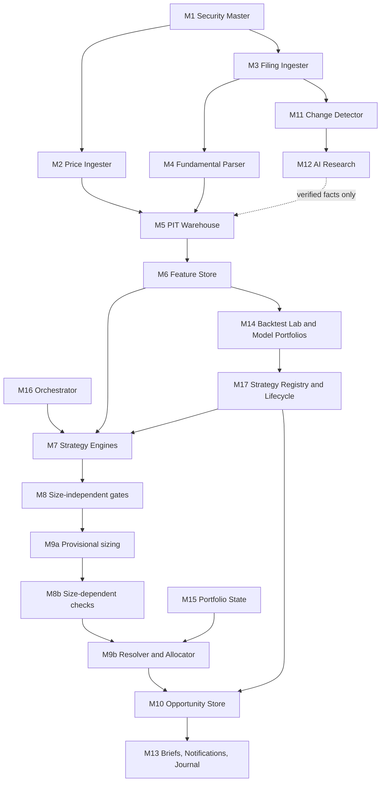

# Core Platform Architecture — Document 01 r9

*Release r5.6 · 24 September 2026 · current state only; revision history is in the Issue Log*

## 1. Purpose, boundary and invariants

The platform continuously evaluates Indian listed equities across every active strategy and surfaces an opportunity only when at least one production strategy qualifies it. It knows nothing about any strategy's economics: strategies are data (cards) that the platform loads, compiles and runs.

**Invariants — true regardless of strategy:**

1. Point-in-time truth: nothing is used before `usable_from = greatest(effective_from, system_available_at)` is at or before the cutoff **of its own data domain** (Document 02 §3).
2. Unknown is a value, never a zero, a false or a pass.
3. Deterministic numerical logic. AI reads documents and proposes extractions; it never scores, forecasts, sets thresholds or promotes strategies.
4. Absolute gates, never quotas. Silence is a valid output.
5. Every signal expires. Expiry never sells a holding; only exit rules sell.
6. Immutable raw inputs and immutable executed trades.
7. No credential in the system can place an order.
8. Scope grows by substitution, not addition.

## 2. Document set and authority

| Artefact | Owns | Precedence |
| --- | --- | --- |
| Overview v5 | Product scope and principles | Lowest — explanatory |
| Document 01 (this) | Modules, flows, state machines, boundaries | Architecture |
| Document 02 | Tables, fields, sources, timing, feature definitions | Governs every definition |
| `registry.yaml` | Vocabularies, feature definitions, evaluation semantics, window conventions, scoring | Machine form of Document 02; each entry versioned |
| `strategies/*.yaml` | Each strategy's hypothesis, thresholds, construction and rules | Only executable source of a strategy |
| `lifecycle/transitions/*.json` | Each card version's status | The only source of a status (§10) |
| `reference_engine.py`, `reference_features.py`, `reference_sim.py` | Executable meaning of cards, features and simulation | Fixed by the golden files; production must match |
| Document 03 | Explanation of the strategies; card sections **generated** from the YAML | Never authoritative over the YAML; parity-checked |
| `schemas/*.json` | Closed shapes for cards, run manifests, portfolio policy, lifecycle transitions, holdout ledger | Machine form |
| Document 04 r5 | Validation, simulation, costs, tax, golden cases, promotion statistics | Governs how backtests are run and judged |
| Document 05 *(before M12)* | AI evidence schema, threat model, model governance | Gate before any AI component |
| Document 06 *(before dashboard)* | Presentation semantics | — |
| Document 07 *(phased — §17)* | DDL, migrations, CI, deployment, operations, non-execution enforcement | Each control is due at the phase §17 names |

**The controlling package is the set of files bound by `MANIFEST.json`.** An editable document is a draft until it is exported into the package and hashed. Two files live outside the package and control nothing in it: `START-HERE.md`, the project's status and handover note, and `audit/`, the audit reports and their reproduction scripts. On what the system is and does, the package wins.

## 3. Modules and flow



| Module | Responsibility |
| --- | --- |
| M1 Security Master | Security identity (`security_id` across ISIN changes), aliases, state tables, corporate actions, share counts |
| M2 Price Ingester | Versioned daily price and delivery observations; row quarantine; the three price series |
| M3 Filing Ingester | Announcements and filings with exchange timestamps; archival by hash |
| M4 Fundamental Parser | Canonical financial facts with reporting durations and versions |
| M5 PIT Warehouse | The only answer to "what was known at `as_of_ts`" |
| M6 Feature Store | Every feature in the registry, computed from M5 only, equal to `reference_features.py` on every golden case |
| M7 Strategy Engines | One engine instance per registered card; evaluates gates, ranking and exits as `reference_engine.py` does |
| M8 / M8b | Size-independent gates; size-dependent checks after sizing — at model size for measurement, at actual size for recommendations |
| M9a | Provisional size per strategy claim, from the card's sizing method |
| M9b Resolver and Allocator | Merges claims per security; converts claim weight to your capital; applies the portfolio policy; final sizes |
| M10 Opportunity Store | Opportunities, strategy claims, lifecycle states; **enforces publication rights** |
| M11 Change Detector | Deterministic document diffing before any AI |
| M12 AI Research | Structured extraction and thesis monitoring; no credentials; Document 05 gate |
| M13 Briefs, Notifications, Journal | Opportunity briefs, urgency routing, decisions |
| M14 Backtest Lab | Simulation, walk-forward, trials, model portfolios per strategy under each card's construction |
| M15 Portfolio State | Read-only holdings, cash and executed trades; reconciliation (Doc 02 §15) |
| M16 Orchestrator | Schedules and event triggers; decides which engines run and when |
| M17 Strategy Registry and Lifecycle | Loads compiled cards; owns lifecycle records, status and evidence |

## 4. Strategies, not buckets

- **A strategy is an independent method of detecting an opportunity**, defined by one card. It is not a category a stock belongs to, and not a capital bucket.
- **Strategy classes** (`fundamental_long_term`, `momentum`, `swing`, `event_catalyst`, `intraday`, and future ones) are registered with their allowed data resolutions, triggers and validation class. A card declares its class; the platform uses that only to select data, triggers and the validation protocol.
- **The set of strategies is open.** Adding one means adding a card that passes the linter, registering it (§10) and taking it through the lifecycle. No platform code changes, and no other card's pin changes (§8).
- **Measurement and personal sizing are separate.** A card's `sizing` and `construction` define its **model portfolio**: the measurement capital in INR, the target volatility or risk to the stop, the maximum position, the maximum number of positions and how scarce capacity is filled. These are **part of the hypothesis**: pre-registered once, before the first design evaluation, and never set from your circumstances — the concentration and capacity rule change what is being tested, and the measurement capital decides which size-dependent checks pass. Your actual capital, caps and risk live only in `portfolio_policy.yaml` and the allocator (§9), and changing them never changes a strategy's measured results.
- **Per-strategy caps** are optional user policy, `NONE` by default.
- **New strategies cannot appear autonomously.** The system may log candidate hypotheses for research. A strategy recommends only after the lifecycle in §10.

## 5. Orchestration

M16 runs every registered engine on the triggers its card declares; you never choose a screen.

| Trigger | Fires | Typical use |
| --- | --- | --- |
| `daily_eod` | After the day's exchange files arrive (feed deadline 23:00 IST) | Risk loops; long-term re-evaluation |
| `weekly_eod` (weekday W) | The last executable session of each ISO week on or before W — Thursday when Friday is a holiday or a muhurat session, which trades but is not executable under the registry's `session_policy`; a week with none is skipped | Momentum entry |
| `on_filing` | When M3 records a new or revised filing | Marks the security for the **next** `daily_eod` evaluation. A filing at 10:00 never evaluates against a session that has not closed |
| `intraday_interval` (minutes) | During the session | Intraday — reserved |
| `continuous_session` | On each new bar or quote | Intraday — reserved |

Each card declares **entry triggers** (when new signals may form) and one **risk trigger** (when exits, stops and invalidations on held claims are evaluated). A weekly exit names its weekday and follows the same rule. Every run receives one `as_of_ts` and writes a run manifest (§13). Runs are idempotent: re-running with the same manifest produces the same outputs.

## 6. Universes

| Universe | Contains |
| --- | --- |
| Research | Every security with data, delisted included |
| Market-eligible | Point-in-time top-N by market cap, N and the buffers fixed by `policies/market_universe.yaml` (v1: N = 500), continuous-settlement series, not suspended. Membership and its hysteresis are kept per `security_id`, so an ISIN change does not restart it |
| Intraday-eligible *(reserved)* | Market-eligible, plus the intraday liquidity and data-coverage conditions of Document 02 §16 |
| Strategy-qualified | Per strategy: passes its own universe filters, data requirements and gates |
| Personally actionable | Strategy-qualified, then the restricted list and portfolio policy applied |

Strategies are **measured** at the strategy-qualified layer; M14 never applies your restricted list. You **see** the personally actionable layer. A claim that is strategy-valid but blocked by your policy is kept and shown as *valid but not currently actionable*.

## 7. Evaluation semantics

The registry's `evaluation_semantics` (versioned, and inside every card's closure) is normative; `reference_engine.py` is its executable form and `golden/card_cases.yaml` fixes it.

- **Values.** `missing`, `stale`, `conflicted` and `not_applicable` are *non-known*. `out_of_domain` resolves by the feature's declared outcome (`fail` or `drop`).
- **Arithmetic.** Decimal. Gate, exit and filter inputs are quantised to 9 decimal places (half-even) and then compared exactly with the card's literals, so two feature builds that differ only by floating-point summation order reach the same decision.
- **Gates** resolve inputs before any logic, in this order: a non-known input whose effective unknown behaviour is `fail` → FAIL; one whose behaviour is `exclude` → EXCLUDED; an `out_of_domain: fail` input → FAIL; an `out_of_domain: drop` input → UNKNOWN; a non-known `penalise` (secondary) input → UNKNOWN; otherwise the expression is evaluated on known inputs to PASS or FAIL. A composite referenced by a gate carries its inputs. Gates therefore never combine unknowns logically. A `stale` or `conflicted` material input excludes rather than being used.
- **Candidacy:** in the candidates after universe filters, every gate PASS or UNKNOWN on a gate with `unknown_blocks: false` (which the compiler allows only for secondary inputs, directly or through a composite), and, in a `rank_and_gate` card, a rank. An **unrankable** security is not a candidate: it is recorded with its reason and never admitted after the ranked ones.
- **Exits** use Kleene three-valued logic: AND is FALSE if any operand is FALSE, TRUE if all are TRUE; OR is TRUE if any operand is TRUE, FALSE if all are FALSE; otherwise UNKNOWN. An exit **fires** when its expression is TRUE. It also fires when an input it reads (for `persist`, on the latest unit) is `out_of_domain` with outcome `fail` — a thesis input that has become meaningless in the failing direction sells the position rather than holding it — unless the exit declares `on_out_of_domain: review`. Otherwise UNKNOWN raises a review trigger and the position is held.
- **Universe filters:** FALSE removes a security from the candidates and from the scoring population; UNKNOWN removes it from the candidates only.
- **`persist(cond, n, unit)`** is TRUE if and only if `cond` is TRUE on the last *n* evaluable units; UNKNOWN if any of them is UNKNOWN or fewer than *n* exist; FALSE otherwise. Non-trading days are not units, and neither are muhurat sessions (below).
- **Sessions.** Muhurat trading is a real NSE session and its bars are stored. By platform policy (the registry's `session_policy`, v1) only `normal` sessions are *executable*: a muhurat or special pre-open session is not a unit for any window, lookback, `persist` or holding count; no evaluation runs in it; and no entry, exit or stop is proposed, tested or filled in it. Its price move falls in the next executable session's return. This is a choice, not a fact about the exchange: changing it is a new policy version, which re-pins every card.
- **Selection methods:** `gate_only` (qualifies on gates alone) or `rank_and_gate` (scores the population before gating per the registry's `cross_sectional_scoring`, then ranks the survivors). A rank never forces a recommendation; in a `rank_and_gate` card it decides who fills scarce model-portfolio capacity (§9).
- **Ranking inputs** (a feature under `z()` in the ranking expression, or an input of a composite it uses) resolve like this:
  - known: its value is used;
  - conflicted: its primary value is used, and it lowers confidence;
  - otherwise, by its effective unknown behaviour. `fail` or `exclude` means no rank. `penalise` means the input is left out of its composite, which still needs `min_inputs_known` inputs; for a direct `z()` term it means no rank. `out_of_domain` with outcome `fail` means no rank, and with outcome `drop` it acts as `penalise`.

  A composite may tolerate missing **secondary** inputs only: the compiler requires `min_inputs_known` to be at least the composite's number of material inputs. So a strategy never ranks on a different formula because material data is missing.
- **Stops are test-then-update:** the stop in force for session *t* is fixed at the close of *t−1*. Exits are tested first; the stop is then updated for the next session. The fill session is itself session *t*.
- **Materiality.** Every feature is material unless the registry lists it as secondary. A material input may never be `penalise`, and may never feed a gate that waives on unknown, directly or through a composite.
- **Confidence.** `data_confidence` starts at `high` and falls one band (`high → medium → low → insufficient`) for each card feature that is **either** a penalised input that is not known, **or** a conflicted input used in ranking. A feature that is both still costs one band. Below `medium` a claim is recorded but never shown as a recommendation. Confidence never changes a score, a rank, candidacy or the model portfolio. A candidate is taken within capacity whatever its confidence, so what is measured does not depend on what is shown.
- **Publication.** A claim is published when the model portfolio takes the candidate and its confidence is at least `publish_minimum`. The model takes a candidate when its size-dependent checks pass at model size and a slot and cash remain in capacity order. A candidate the model cannot take is recorded as `size_check_failed` or `no_capacity`, so what is recommended is what is measured. `reference_engine.run_pipeline` is the executable definition, fixed by `golden/pipeline_cases.yaml`: population → universe → filters → ranking → gates → size checks → capacity → quantities → published claims.
- **Review triggers** appear in monitoring. In a model portfolio they never trade, and every occurrence is counted in the validation report.

## 8. Strategy cards and the compiler

A card must satisfy `schemas/card.schema.json` (v6), which is **closed**: any field not defined there is an error. The card carries no status. `speclint.py` then compiles it against the registry:

1. **Schema stage** — shapes, types, ranges, positivity, semantic-version form, minimum hypothesis length, structured retirement, calibration (including its sampling), construction, void parameters. Malformed input produces errors, never a crash.
2. **Semantic stage:**
   - **The registry pin**: the card pins the canonical SHA-256 of its **registry closure**. That is the entries it references: its features, the forensic flags if it reads their count, functions, runtime values, class, resolution, triggers, sizing method, void events and corporate-action policy. It also includes the enums its expressions compare against or its enum-typed features use, and any registry block a feature declares in `depends_on` (for example `ey_median_5y` depends on `valuation_transformative_actions`). On top of that come the blocks that give every card its meaning: evaluation semantics, window conventions, session policy, confidence and cutoff policies and security identity. Cross-sectional scoring is included only for cards that score a population. An edit outside the closure leaves the pin intact: a feature for another strategy, a new sector code, a new value in an enum the card only uses as a field value (a weekday, a horizon), or a comment. An edit inside it breaks the pin, and the card must be re-validated, and versioned if its meaning changed. Adding a value to a field enum cannot change an existing card's meaning, and every lint checks the card's field values against the current registry.
   - Class, data resolution and triggers; vocabularies; the expression grammar with types and arity; namespaced enum literals.
   - **Permitted date arguments**: price functions accept only `signal_date`, `eval_date` and `prev_session` of either, so no expression can name a session after the evaluation.
   - **Materiality through composites** (including `min_inputs_known` covering every material input), and a **structural hard-cap bound**: every quantity is `min(…, floor(hard_cap_value / entry_high or tranche_limit), …)`.
   - Reference integrity; runtime-state assignment (§11); corporate-action completeness; void-event parameters; construction consistency (a `rank_and_gate` card fills capacity by rank); AI-input declarations; and status-dependent completeness: above `experimental`, no `OPEN`, `CALIBRATE` or placeholder function may remain, in sizing or construction.

`test_speclint.py` holds a regression case for every defect found in every review round, each asserting its specific violation, plus closure-scope, lifecycle and schema-contract checks. It runs directly or under pytest.

**A PASS proves a card is well-formed, not that it is right.** What a card *means* is fixed by executing it. `test_card_golden.py` runs the card's own expressions through `reference_engine.py` against hand-computed cases, and plants card edits that must each break one. `test_pipeline.py` runs whole populations through `run_pipeline` to the published claims.

**Freeze criterion for any card:**

- linter PASS;
- suite PASS;
- render parity PASS;
- reference, feature, card-level and pipeline golden cases PASS;
- mutation check PASS.

## 9. Opportunities, claims, sizing and allocation

**Opportunity (parent)** — one per security while any claim is live: `opportunity_id` · `security_id` · `isin` · `state` · `first_surfaced_at` · `final_qty` · `capital_reserved` · `actionability` (`actionable` / `valid_but_not_currently_actionable` + reason).

**Strategy claim (child)** — one per strategy per cycle: `claim_id` · `opportunity_id` · `strategy_code` · `card_sha256` · `lifecycle_transition_id` · `cycle_no` · `direction` · `horizon` · `rank` · `rationale` · `gate_values` · `entry_ref` · `entry_high` · `tranche_limit` · `invalidation` · `expires_at` · `target_weight` · `target_earmark_qty` · `current_earmark_qty` · `claim_state`. The key is `(opportunity_id, strategy_code, cycle_no)`, so a strategy can exit and re-qualify without overwriting its earlier cycle.

**States:** `signal` → `partially_entered` → `fully_entered` → `closing` → `closed`, plus terminal `expired` and `voided` for signals that never filled. Signal TTL applies only before the first fill. Void events are registered state transitions with declared parameters (registry `void_events`; card `void_parameters`).

**Conflicting claims are shown, not reconciled.** One strategy may be accumulating a security while another's exit fires on its own claim. Convergence is displayed and never scored or used to size up.

**Tranches.** Quantities convert at the prior session's close (known before the open), and the limit acts only as a price cap. Tranche 1 re-evaluates every gate on every attempt and voids the signal if any fails. Later tranches re-evaluate their declared gates; a failed recheck skips that session's attempt within the retry window. If the window is exhausted, remaining tranches are cancelled and reserved capital released — the holding is never sold. Each tranche takes at most the remainder (`revised_target_qty − current_earmark_qty`), so integer flooring never strands shares and a falling target never over-buys.

**Model portfolios (M14): capacity.**

- Each card's `construction` sets its maximum positions and capacity order.
- Existing positions are never displaced.
- New claims fill free slots in **rank order** (`rank_and_gate`), or in earliest-signal order (`gate_only`).
- Only ranked candidates reach capacity: an unrankable security is not a candidate (§7), and `construct` refuses one. Ranks within the tie tolerance break on higher market cap, then ISIN.
- Each claim is sized at `min(target_value, spendable cash)`. Its model `hard_cap_value` is `min(notional_capital × max_position_pct, the cash allotted)`, so even the worst permitted fill never overdraws the model's cash. Residual cash stays uninvested.
- `reference_engine.construct` and `run_pipeline` fix this.

**Allocator (M9b): one security, one decision.** A claim sized on the card's measurement capital becomes a **weight**: `target_weight = target_value ÷ notional_capital`. Then, for the actual recommendation:

1. **Target = the largest live claim weight × your `total_capital`**, never the sum. Two strategies agreeing must not mechanically double exposure.
2. **Size-dependent checks are re-run at the actual size** (M8b). A claim that passes at model size but fails at your size — impact or participation — is *valid but not currently actionable*, naming the check.
3. **Caps apply in policy precedence order** (`portfolio_policy.yaml`): restricted list, per stock, per promoter group, per sector, per strategy (`NONE` by default), position count, cash floor, drawdown state. `hard_cap_value` for the recommendation is the allocator's headroom; the engine enforces `qty ≤ floor(hard_cap_value ÷ entry_high)` whatever the card says.
4. **Scarce capacity is resolved deterministically**, without inventing a cross-strategy score: existing holdings first, then the earliest signal, then larger market cap, then ISIN. A claim that cannot reach `min_position_pct` within the remaining headroom is not actionable.
5. **A breach never deletes a claim.** It is marked `valid_but_not_currently_actionable`, with the binding cap named.
6. **When a claim closes, the target falls to what the remaining claims support** — the largest surviving weight. The position is trimmed only if it exceeds that target by more than `trim_tolerance_pct`.

**Executions and your deviations from the plan.** `executed_trade` rows in M15 are immutable. `opportunity_execution` links a fill to one or more claims with `allocated_qty`; allocations must sum to the fill, and slippage is always computed from linked fills. The actual claim follows *your* fills, not the plan:

- a partial fill leaves it `partially_entered`;
- the tranche schedule counts from your first linked fill;
- later tranche quantities are `revised_target_qty − current_earmark_qty` from your earmark;
- a fill above the limit is accepted and flagged;
- the stop and entry basis come from your fills.

A manual holding counts toward caps and "existing holding" priority but creates no claim. The model claim follows the simulated fills. The two are compared automatically (§12). Golden cases for these paths are a Stage 3 gate.

## 10. Strategy lifecycle and publication rights

**A card version's status is held only in lifecycle transition records** (`lifecycle/transitions/*.json`, schema `strategy_lifecycle_transition.schema.json`): previous and new status, card SHA-256, decision, reason, and the evidence the transition requires. The card file carries no status, so a status change never changes a card's hash. `register_card.py` writes the first record; M17 writes the rest. The linter derives each card's status from the latest record for its exact hash and checks that the chain is continuous. Records are ordered by the **instant** in `decided_at`, which must carry a UTC offset, not by its text: `18:00+05:30` is earlier than `13:00Z`. Two records at the same instant, a record filed before one it was decided after, and a `decided_at` in the future are all errors. `register_card.py` stamps the real time.

| From → to | Evidence required |
| --- | --- |
| none → experimental | Linter report; **holdout-exposure declaration**: the lineages this card derives from, and the lineages whose sealed holdout results its author has seen (the card's lineage inherits their exposure — Document 04 §7) |
| experimental → shadow | Backtest run IDs, sealed holdout run, ledger entry, golden-case report, linter report, validation report; no OPEN, CALIBRATE or placeholders |
| shadow → production | Shadow run IDs over the declared period; linter report; validation report |
| production → suspended / retired | The retirement metric breach or the data fault that triggered it |
| suspended → production | Validation report; linter report |

| Status | May do |
| --- | --- |
| experimental | Backtest only |
| shadow | Generate shadow claims, recorded, never shown as recommendations |
| production | Publish claims to the opportunity feed |
| suspended / retired | No new claims; existing claims continue to exits |

**M10 enforces this server-side at publication.** A claim whose card version's recorded status is not `production` cannot become a visible recommendation.

## 11. Runtime state

Every runtime value in an expression has a declared owner in the registry:

| Owner | Meaning | Example |
| --- | --- | --- |
| `provided` | Supplied by the engine from a named source | `eval_date`, `holding_days` |
| `derived` | Computed from a card field, which must exist | `revised_target_value` ← `sizing.revised_formula` |
| `stateful` | Engine-maintained, with declared initialisation and update | `highest_close_since_entry`, `stop_in_force`, `atr_pct_at_signal` |

The linter rejects any derived value whose card field is missing, and any stop state used without a stop.

**Stop state machine, per session *t*, for a held claim:**

1. Test exits against `stop_in_force` (fixed at *t−1*).
2. If not exited: if `close_raw(t) > highest_close_since_entry` (strictly), set `highest_close_since_entry = close_raw(t)` and `atr_pct_at_peak = atr_pct_20(t)`; ties change nothing.
3. `stop_prev = stop_in_force`; `stop_in_force = stop.update`.

On the fill date:

- `entry_basis` is the quantity-weighted fill price.
- `highest_close_since_entry` is the fill price.
- `atr_pct_at_peak` and the initial stop use **`atr_pct_at_signal`**, the ATR known at the signal.
- `stop_in_force = stop.initial`.

The stop is therefore known before the order is placed, and a fill anywhere up to the limit cannot take risk beyond the budget. That same session's close is then tested against it.

Every price-state value is transformed by the corporate-action policy on ex-dates. It is carried through an ISIN change under the same `security_id`. The fill itself is never rewritten.

## 12. Briefs, notifications, monitoring and the journal

**Brief contents:** security; each claiming strategy with its status, horizon and direction; why now; triggering gate values; supporting evidence; material counter-evidence; data confidence, model status and evidence strength shown separately; portfolio fit and actionability; entry range, invalidation (the stop level, known before the order), expiry; lineage (run manifest ID).

**Counter-evidence is stated with its coverage, never as bare absence.** For each counter-evidence class, the brief shows what was searched and its coverage, for example "auditor-change archive covered to 30 Jun 2026; filings scanned since 1 Apr". It says **"none found"** only when that class's machine-checkable coverage condition holds. Otherwise it says **"not searched"** or **"coverage X%"**. The conditions are defined per class in Document 05 (before M12) and Document 06; until then the brief shows coverage only.

**Notifications** are policy, separate from generation. Every qualifying claim is recorded, and urgency follows horizon: intraday and event claims notify immediately; days-to-weeks claims go to the daily brief; months-to-years claims go to the next brief. A "no qualifying opportunities" brief is itself published on schedule, carrying the funnel health summary.

**Monitoring** follows each live opportunity and reports what changed — a gate value moving, evidence arriving, expiry approaching — rather than regenerating the whole analysis.

**Journal:** three decision timestamps (generated, first viewed, decided) plus zero-to-many execution timestamps from linked fills. Accept, reject or defer, optionally with a reason. Model-versus-actual comparison is automatic.

## 13. Storage and reproducibility

- **Parquet is the source of truth**, written atomically, never edited, through one pre-write validator shared by every codec. DuckDB runs in memory over explicit file lists generated from a snapshot. No persistent database file exists.
- **Every source file is landed first.** Its exact bytes are stored write-once under `_raw/<source_id>/<sha256>` before anything is parsed, and parsing reads that copy. A `raw_file` row, committed in the same batch as the observations, names it (Document 02 §12).
- **Durability and the writer lock are per platform** (`eos/fsio.py`). A replace is durable through a directory fsync on POSIX, and through `MoveFileExW` with write-through on Windows, the warehouse machine's OS. A Windows sharing violation is retried with bounded backoff. The single writer holds an operating-system lock, released by the OS if the process dies, so a crash never leaves a stale lock.
- **Run manifest** (`schemas/run_manifest.schema.json`). Every evaluation, backtest, shadow run and replay records:
  - both domain cutoffs, the trading date, and the data snapshot and its hash;
  - the package digest;
  - each card's hash, **registry closure hash**, **lifecycle transition** and recorded status;
  - the whole-registry hash and the **evaluation-semantics version**;
  - source-policy, sector-map, calendar and corporate-action-policy versions;
  - the feature build: a version **and implementation hash per feature**;
  - content hashes of the simulator, source policy, sector map, trading calendar, market-universe policy, cost schedule, tax schedule and portfolio policy;
  - code commit, container image digest, dependency lock hash, engine settings and seed.

  A backtest must declare `holdout_access`; a sealed evaluation must name its holdout-ledger entry. A backtest or replay must declare its `price_read_contract` (§14), and a sealed evaluation must use `exact_per_decision`. Two runs are "the same run" when every field other than `run_id` and `created_at` is identical.
- **Deterministic engine settings:** aggregations run in a declared, fixed order; values within 1e-9 are treated as ties and broken by market cap, then ISIN; the settings are recorded in the manifest.

## 14. The canonical point-in-time interface

M5 is the only module that answers point-in-time queries. Two rules make the canonical join correct:

- **One availability column.** Every PIT row carries `usable_from = greatest(effective_from, system_available_at)`, materialised at ingestion. An AS-OF join supports one inequality, so availability must be a single column.
- **Filters inside the right-hand relation.** The AS-OF match picks the single nearest row. A basis filter applied *after* the join discards that row when it has the wrong basis and returns nothing, even though an earlier row of the right basis existed.

```sql
SELECT p.isin, p.trade_date, f.*
FROM price_raw_resolved(:snapshot) p          -- latest price version usable at each row's cutoff
ASOF JOIN (
    SELECT * FROM pit_financial_facts_wide
    WHERE basis = 'consolidated'              -- filter BEFORE the match, never after
) f
  ON  p.isin = f.isin
  AND p.row_cutoff_ts >= f.usable_from        -- per-row cutoff, not one run-level value
```

This join serves single-row facts. **Multi-period fundamentals** (TTM, three- and five-year windows) are assembled by the period panel of Document 02 §7: each period at its latest version usable at the cutoff, with the basis decided as of the cutoff for the whole window.

`row_cutoff_ts` is the evaluation cutoff of that trading date — 20:00 IST for disclosures — never midnight. For a live run, every row's cutoff equals the run's `as_of_ts`. `price_raw_resolved` returns, per `(isin, trade_date)`, the latest price version whose `usable_from` is at or before the cutoff (Document 02 §6). Two read contracts must not be confused:

- **`history_known_as_of(E)`** gives the exact input of one decision at E.
- **`point_in_time_panel(start, end)`** gives each bar as first known — the version usable at its own date's cutoff, or, for a bar first published after that cutoff, its first version with its real `usable_from`. **`panel_as_of(panel, E)`** is what one decision at E may use from it. Nothing a later decision had is dropped, and nothing it lacked is visible.

They are not equal evidence. `exact_per_decision` (history as known at each decision) is the evidential standard, and the only contract a sealed holdout evaluation may use. `first_known_panel` is look-ahead-free but **information-poorer**: a correction a decision could have known is ignored when the bar was first printed earlier. That is not "conservative": a stale, wrong print can help a strategy as easily as hurt it. Results on the panel are labelled and never used as promotion evidence. A decision sequence built from `history_known_as_of(end)` would let early decisions see later corrections. No module writes its own point-in-time join. The look-ahead canary raises a hard error — not an empty result — when any consumer reads a row whose `usable_from` is after its cutoff.

## 15. Non-execution boundary, as policy

- The broker adapter is **read-only by interface**: it exposes holdings, positions, trades and funds, and has no order, modify or cancel methods.
- **The credential itself must be read-only at the provider.** An adapter without an order method is not sufficient if the mounted credential is authorised to trade. If the broker offers no credential that technically lacks order permission, no broker credential is mounted at all and M15 is fed by statement import instead. This is mandatory before any real account is connected.
- Broker credentials are separate identities, mounted only into M15. M12 and M13 have no network route to any broker.
- CI scans source code, generated clients and dependencies for order endpoints and fails on any match.
- The deployment manifest, network policies and scans are specified in Document 07 and tested before shadow use.

## 16. AI boundary

M11 diffs documents deterministically before M12 sees them. M12 returns structured extractions with evidence references. A deterministic checker, plus human confirmation where the registry requires it, turns an extraction into a fact in M5 with its own `source_id`. A card may consume AI-derived features only if `ai_inputs.permitted` is true and each feature is registered as `ai_derived` with its verification path. AI cannot change thresholds, promote strategies, rewrite history or touch execution. Document 05 must exist before M12 is built.

## 17. Build order and gates

| Stage | Build | Gate before continuing |
| --- | --- | --- |
| 0 | Source adapters, XBRL prototype, M1, M2, coverage report, vendor bake-off | Document 02 §17 Stage 0 acceptance |
| 1 | M3–M6, M5 canary, run manifests (with snapshot persistence), M16 | PIT golden cases; canary hard-fails; M6 equals `reference_features.py` on every feature golden case |
| 2 | M7, M8, M9a/b, M14, M17 | Reference, card-level, feature and pipeline golden cases pass unmodified on the production engine; replay reproducibility |
| 3 | M10, M13, M15 | Lifecycle enforcement tests; M15 reconciliation tests; actual-versus-model divergence golden cases (§9); non-execution tests |
| 4 | Shadow operation | Healthy-silence soak; kill-switch tests; promotion evidence |
| 5 | M11, M12 | Document 05; prompt-injection and verification tests |
| 6 | Intraday data and engines | Document 02 §16 contract implemented; intraday validation class in Document 04 |

**Controls by phase.** "Document 07" is not one gate. Each control is due at the phase where its absence could first contaminate something:

| Before… | Controls |
| --- | --- |
| **Trusting any warehouse data** | Batch-atomic ingestion and crash recovery, a single writer lock, duplicate-identity failure, a codec-independent store validator, row quarantine (in place from r5.5); per-platform durable replace, an OS writer lock that a crash releases, and write-once raw landing (from r5.6). **The full M2 suite, and `run_all.py --require-parquet`, passing on the warehouse machine itself (Windows)**: the Windows code paths are exercised against an emulation elsewhere, which is not evidence that they work on Windows |
| **Live capture begins** (the scheduled downloader) | `live_capture_start` set in the source policy, so no later file can be back-dated |
| **Closing Stage 0** | Document 02 corrections from real files. Special-dividend semantics settled. The security-identity table populated from real ISIN changes |
| **The first calibration or backtest run** | Append-only trial log and lineage holdout enforcement, executable rather than prose. Brinson–Fachler with cash defined, with golden cases (drawdown, rolling-window share and the promotion statistic exist from r5.5). A semantic run-manifest validator deriving each run's full artefact and feature closure. A parent/child identity for multi-date simulations. Every card sizing and construction parameter set (pre-registered). The mutation check green |
| **Shadow operation** | Every transition's evidence resolved and verified. Actual-portfolio state and promoter-group map bound into decision lineage. Deployment, network, credential and order-endpoint controls. Kill-switch atomicity. Restore and replay tests. Counter-evidence coverage conditions (§12) |
| **Production** | Executable retirement metrics. Defined shadow-versus-backtest tests with named estimators. Monitoring |
